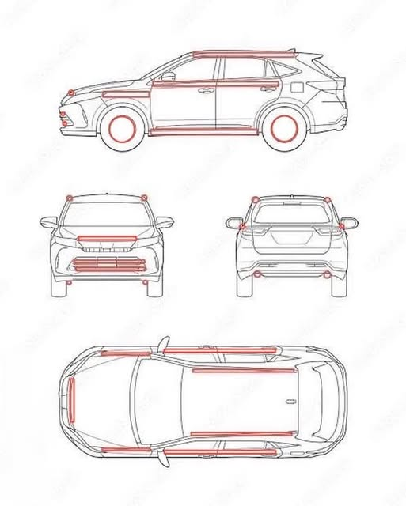

# Ultimate Hybrid Vehicle UHV Concept

[日本語版](README_ja.md) | [العربية](README_ar.md)

An open-invention concept for climate-adaptive vehicles integrating airflow energy recovery and center-mist evaporative cooling, especially for dry climates, desert cities, and retrofit urban cooling systems.

## A Climate-Adaptive Mobility Concept Integrating AER-Loop and Center-Mist Cooling

---

## Overview

The **Ultimate Hybrid Vehicle UHV** is a conceptual mobility system that redefines vehicles not merely as means of transportation, but as **mobile environmental support nodes** that integrate airflow, regenerative energy, waste heat, water circulation, and evaporative cooling.

Conventional vehicle development has mainly focused on the following goals:

* improving fuel efficiency
* reducing exhaust emissions
* increasing battery capacity
* extending driving range
* improving autonomous driving
* expanding charging infrastructure

These are important technological advances.

However, from the perspective of urban environments, vehicles still release large amounts of heat, turbulence, braking energy, auxiliary-system losses, and air-conditioning waste heat into their surroundings.

The UHV concept aims to redesign these discarded physical phenomena and transform vehicles into systems that can support the thermal environment around roads and cities.

> UHV is a mobility concept that integrates airflow, heat, rotation, braking energy, and the evaporative cooling of water, enabling vehicles to support local urban and roadside thermal regulation while moving.

---

## Concept

UHV is not a single new engine, a single cooling device, or a conventional hybrid system.

It is a **compound, distributed, and retrofit-compatible vehicle environmental system** that combines existing technologies with derived design concepts.

The basic structure consists of three layers.

```text
Ultimate Hybrid Vehicle: UHV
│
├─ 1. AER-Loop Layer
│   ├─ partial recovery of airflow energy
│   ├─ vertical-axis micro wind generation
│   ├─ regenerative braking
│   ├─ micro-generation around shafts and gears
│   ├─ natural wind generation while parked
│   └─ reuse for auxiliary power and cooling systems
│
├─ 2. Center-Mist Cooling Layer
│   ├─ ultrasonic mist cooling
│   ├─ mist injection into the central airflow
│   ├─ hollow shaft structure
│   ├─ offset drive structure
│   ├─ spiral return structure for large droplet recovery
│   └─ evaporative cooling in dry climates
│
└─ 3. Retrofit Mobility Layer
    ├─ installation on existing vehicles
    ├─ application to buses, trucks, and taxis
    ├─ application to railways, ships, and work vehicles
    ├─ deployment in dry and desert cities
    └─ expansion as urban cooling infrastructure
```

---

## Background

Urban overheating is not caused by air temperature alone.

Asphalt, concrete, dense buildings, traffic, air-conditioning exhaust, industrial heat, and data-center heat combine to worsen local thermal environments.

Roads are especially important heat-storage surfaces because they:

* absorb strong solar radiation
* store heat in asphalt
* concentrate vehicle waste heat
* generate tire friction and braking heat
* release stored heat even at night
* directly affect pedestrians, cyclists, and public transportation users

Conventional electric and hybrid vehicles can reduce exhaust emissions, but they generally do not directly improve the thermal environment around roads.

The UHV concept introduces a different viewpoint.

> Instead of treating vehicles only as heat sources, UHV treats them as mobile infrastructure that can use airflow, rotation, water, and cooling mechanisms to locally mitigate urban heat.

---

## Visual Concept

<p align="center">
  
</p>

<p align="center">
  <em>Figure 1: Photorealistic rendering of the UHV concept vehicle. This image illustrates a possible exterior vision of the Ultimate Hybrid Vehicle.</em>
</p>

---

## Concept Layout

<p align="center">
  
</p>

<p align="center">
  <em>Figure 2: UHV concept layout diagram. The red lines indicate candidate locations for vertical-axis wind generation, airflow ducts, center-mist cooling, and auxiliary power recovery units.</em>
</p>

---

## Fundamental Design Principles

The UHV concept is based on five main principles.

### 1. Recover Lost Energy as Auxiliary Power

During vehicle operation, energy is lost in many forms:

* aerodynamic drag
* turbulence
* braking heat
* rotational losses
* airflow around tires
* heat from motors, batteries, and inverters
* air-conditioning load

UHV does not attempt to recover all of this energy.

Instead, it aims to recover part of it in a distributed way for practical auxiliary uses such as:

* sensors
* cooling fans
* control systems
* emergency power
* auxiliary batteries
* external cooling modules

It is important to clarify that airflow generation in UHV is not intended to be the main driving power source.

A vehicle cannot obtain unlimited energy from airflow that is created by its own motion.

Therefore, airflow recovery in UHV should be understood as:

> a distributed auxiliary recovery system that reuses part of the energy that would otherwise be lost as drag, turbulence, or heat.

---

### 2. Use the Vehicle Surface as an Aerodynamic Recovery Line

During driving, complex airflow occurs around the roof, sides, front, rear, bumpers, and tire areas of a vehicle.

UHV uses parts of the vehicle surface for functions such as:

* vertical-axis micro wind generation
* airflow intake ducts
* airflow paths for mist cooling
* waste-heat diffusion lines
* body-surface cooling lines
* auxiliary power recovery lines

Vertical-axis wind turbines are suitable for this kind of application because they can accept airflow from multiple directions and can respond to crosswinds and turbulent flows around the vehicle body.

However, the design must not significantly worsen vehicle efficiency.

Important design requirements include:

* avoiding excessive frontal-area increase
* preventing additional turbulence
* balancing flow-straightening and power recovery
* evaluating generation mainly as auxiliary power
* meeting vehicle safety standards

---

### 3. Integrate Mist Cooling into the Vehicle Exterior

One of the key features of UHV is the external installation of a **center-mist cooling fan**.

Most conventional mist cooling systems simply spray fine water droplets from nozzles.

This creates several problems:

* large droplets may remain
* roads and pedestrians may become wet
* mist and airflow may not mix uniformly
* evaporation efficiency drops in humid climates
* water droplets may reduce visibility
* vehicle-mounted systems require waterproofing and vibration resistance

The center-mist cooling fan addresses these issues by supplying ultrasonic mist into the central region of the airflow, where it can mix with driving airflow or fan-generated airflow.

By injecting mist from the center, the system aims to improve mixing between mist and air and increase the efficiency of evaporative cooling.

---

### 4. Maximize Evaporative Cooling in Dry Climates

UHV is especially compatible with dry regions such as the Middle East, desert cities, and arid road environments.

In dry air, there is more capacity for additional water vapor, so water evaporates more easily.

When water evaporates, it absorbs heat from the surrounding air. This is evaporative cooling.

Therefore, mist cooling can be more effective in dry climates than in humid climates.

Possible deployment areas include:

* Middle Eastern cities
* desert roads
* airports
* ports
* logistics hubs
* large parking areas
* tourist transport systems
* construction sites
* dry agricultural areas
* heat-stress-prone urban districts

---

### 5. Use Hybrid Cooling Outside Dry Climates

In humid regions, mist cooling becomes less efficient.

For example, in hot and humid summer conditions, water evaporates less easily and may increase the risk of wet surfaces.

Therefore, outside dry climates, UHV should use hybrid cooling control.

```text
High temperature / low humidity:
    increase mist cooling

High temperature / medium humidity:
    use mist cooling and airflow together

High temperature / high humidity:
    reduce mist and rely mainly on air conditioning, airflow, and heat exhaust control

Rain or poor visibility:
    stop external mist

Dense urban or pedestrian areas:
    limit mist output to prevent wet surfaces
```

In other words, UHV is not a mist-only vehicle.

> UHV is a climate-adaptive mobility system that combines air conditioning, airflow, heat-exhaust control, mist cooling, and recovered auxiliary power according to local environmental conditions.

---

## Technical Structure

### 1. AER-Loop

AER-Loop can be understood as an **Airflow Energy Recovery Loop**.

It is a concept for partially recovering vehicle-related airflow, natural wind, braking energy, and rotational losses, then reusing them for onboard auxiliary systems.

Main components include:

* vertical-axis micro wind generators
* regenerative braking
* micro-generation around axles and shafts
* magnetic, piezoelectric, or induction generation around gears
* natural wind generation while parked
* auxiliary batteries
* cooling fan power
* sensor power
* emergency power

---

### 2. Center-Mist Cooling

Center-Mist Cooling is a cooling method that supplies mist into the central region of an airflow, allowing fine droplets to disperse and evaporate more efficiently.

Main components include:

* ultrasonic mist generator
* hollow shaft
* central mist injection port
* offset drive
* spiral return structure
* large droplet recovery path
* water tank
* humidity sensor
* road surface temperature sensor
* ambient temperature sensor
* vehicle-speed-linked control

The purpose of this system is not simply to spray water.

The purpose is to make droplets as fine as possible, evaporate them in the air, and remove heat through evaporative cooling.

---

### 3. Retrofit Cooling Unit

A key implementation feature of the UHV concept is that the entire vehicle does not need to be newly manufactured.

Some functions can be implemented as retrofit modules.

If the external center-mist cooler is modularized, it can be applied to:

* route buses
* tourist buses
* delivery trucks
* taxis
* ambulances
* fire trucks
* construction vehicles
* agricultural machinery
* railway vehicles
* ships
* airport service vehicles
* port service vehicles

This makes it possible to gradually transform existing transportation systems into distributed urban cooling infrastructure.

---

## Simplified Physical Model

The following simplified models can be used to estimate the cooling and recovery effects of UHV.

### 1. Evaporative Cooling

The heat removed by evaporation can be estimated as:

```text
Q_evap = m_dot × L_v × η_evap
```

Where:

* `Q_evap` = cooling power from evaporation [W]
* `m_dot` = mass flow rate of evaporated water [kg/s]
* `L_v` = latent heat of vaporization of water [J/kg]
* `η_evap` = efficiency factor including actual evaporation ratio, mixing efficiency, and environmental correction

The latent heat of vaporization of water changes with temperature, but it can be approximated as about:

```text
2.4 × 10^6 J/kg
```

This means that the essence of mist cooling is not simply how much water is sprayed.

The key is how finely the water is atomized and how completely it evaporates in the air.

---

### 2. Dynamic Pressure of Driving Airflow

The dynamic pressure of airflow during vehicle motion can be expressed as:

```text
q = 1/2 × ρ × v^2
```

Where:

* `q` = dynamic pressure [Pa]
* `ρ` = air density [kg/m^3]
* `v` = relative wind speed against the vehicle [m/s]

As vehicle speed increases, dynamic pressure increases with the square of speed.

This makes driving airflow useful for mist dispersion and cooling airflow.

However, when using driving airflow for power generation, excessive energy extraction increases aerodynamic drag.

Therefore, the main purpose should be auxiliary power, cooling control, and sensor operation rather than main propulsion.

---

### 3. Approximate Wind Power Recovery

The theoretical power obtainable from wind can be approximated as:

```text
P_wind = 1/2 × ρ × A × v^3 × C_p × η
```

Where:

* `P_wind` = power obtained from wind [W]
* `ρ` = air density [kg/m^3]
* `A` = swept or intake area [m^2]
* `v` = relative wind speed [m/s]
* `C_p` = turbine power coefficient
* `η` = efficiency of generator, rectifier, and power conversion

This equation can also be used for rough estimation of vehicle-mounted wind recovery.

However, when using airflow generated by vehicle motion, the generated power must be evaluated together with the increase in aerodynamic drag.

Therefore, wind generation in UHV is most realistic for:

* sensor power
* external mist control
* auxiliary fans
* communication modules
* emergency lights
* auxiliary battery charging
* natural wind generation while parked

---

## Control Algorithm Concept

UHV should not run external mist cooling at maximum output at all times.

Mist output should be controlled according to environmental and safety conditions.

Main input variables include:

* ambient temperature
* relative humidity
* road surface temperature
* vehicle speed
* wind speed
* wind direction
* pedestrian density
* rain detection
* visibility condition
* water tank level
* battery level
* cabin air-conditioning load

A simple control policy could be:

```text
if rain == true:
    mist_output = 0

elif visibility_risk == high:
    mist_output = 0

elif humidity > 80%:
    mist_output = very_low

elif humidity > 65%:
    mist_output = low

elif humidity > 45%:
    mist_output = medium

else:
    mist_output = high
```

If the road surface temperature is high, humidity is low, and vehicle speed is above a minimum threshold, the system can increase mist cooling.

```text
if road_temperature > threshold
and humidity < dry_threshold
and vehicle_speed > minimum_speed:
    activate_center_mist_cooling()
```

This means that UHV requires variable control based on both climate conditions and safety conditions.

---

## Potential Applications

### 1. Middle Eastern and Desert Cities

In Middle Eastern and desert cities, low humidity, high temperature, and strong solar radiation make evaporative cooling especially suitable.

Possible uses include:

* urban transportation
* airport shuttles
* tourist buses
* logistics vehicles
* desert roads
* large development districts
* outdoor event transportation
* construction vehicles

---

### 2. Urban Heat Island Mitigation

In cities, local cooling effects may be expected by installing retrofit units on vehicles that frequently travel the same routes, such as buses and delivery vehicles.

Potential target areas include:

* bus stops
* station plazas
* commercial districts
* school zones
* elderly care facilities
* large parking areas
* roads adjacent to pedestrian spaces

---

### 3. Disaster and Heat-Stress Response

UHV can also be applied to disaster support vehicles and heat-stress response vehicles.

Examples include:

* local cooling around evacuation centers
* cooling outdoor waiting lines
* external cooling before and after emergency transport
* heat countermeasures for firefighting and disaster response sites
* thermal-environment support around temporary housing areas

---

### 4. Agriculture and Greening Support

In dry regions and agricultural areas, UHV may support water retention and greening under controlled conditions.

However, any use of microbial mist must be carefully tested for safety, ecological impact, and local regulation.

In early stages, such use should be limited to controlled environments such as:

* farmland
* green belts
* desert-greening test zones
* managed ecological restoration sites

---

## Technical Challenges

Practical implementation of UHV requires solving several challenges.

### Aerodynamic Challenges

* minimizing additional drag
* optimizing the placement of wind recovery units
* preventing additional turbulence
* testing effects on vehicle stability

### Cooling Challenges

* reduced efficiency in humid climates
* prevention of road wetting
* control of mist contact with pedestrians
* prevention of visibility reduction
* optimization of water consumption

### Structural Challenges

* waterproofing
* vibration resistance
* sand and dust resistance
* maintainability
* water tank capacity
* freezing countermeasures

### Hygiene and Safety Challenges

* water tank sanitation
* prevention of mold and bacterial growth
* water quality control
* compliance with traffic regulations
* local regulatory compliance

### Social Implementation Challenges

* standardization of retrofit units
* pilot introduction into public transportation
* integration with urban data
* establishment of measurement methods
* cost-effectiveness verification

---

## Phased Implementation Plan

UHV does not need to begin as a complete new vehicle.

A realistic phased implementation could proceed as follows.

```text
Phase 1:
    tabletop and small-fan center-mist cooling experiments

Phase 2:
    simple installation on bicycles, small carts, and work vehicles

Phase 3:
    retrofit cooling unit demonstration on buses and delivery vehicles

Phase 4:
    field testing in dry regions and Middle Eastern cities

Phase 5:
    design of vehicle-integrated AER-Loop systems

Phase 6:
    integration with urban transportation networks
```

---

## Evaluation Metrics

The effectiveness of UHV should be evaluated using measurable indicators such as:

* ambient temperature change
* road surface temperature change
* temperature around the vehicle body
* mist evaporation rate
* water consumption
* generated power
* reduction in auxiliary power consumption
* change in aerodynamic drag
* impact on driving efficiency
* pedestrian comfort
* visibility impact
* presence or absence of road wetting
* maintenance cost
* city-scale deployment effect

---

## Position of This Concept

UHV is not a finished commercial product.

It is a technical concept published as an open invention.

The purpose is not exclusive ownership by a single company, but the sharing of a design philosophy that researchers, engineers, municipalities, transportation operators, students, and independent developers can freely examine, improve, and test.

UHV is based on the following principles:

* technology should follow natural laws
* vehicles are both transportation tools and parts of the urban environment
* lost energy should be reused where practical
* heat should not simply be discarded, but redesigned through circulation, distribution, and cooling
* existing infrastructure should be improved through retrofit-compatible systems rather than replaced all at once

---

## Related Articles and Repositories

### Current Article

* Ultimate Hybrid Vehicle UHV Concept  
  https://note.com/inchacomusho/n/nd6cce23c57bc

### Previous Related Articles

* AER-Loop Related Concept  
  https://note.com/inchacomusho/n/n2d8f31caf428

* Related Concept Article  
  https://note.com/inchacomusho/n/ndfc6d80d992a

* Related Concept Article  
  https://note.com/inchacomusho/n/nc9752b7c576f

### Related GitHub Repository

* Center-Mist Ultrasonic Cooling Fan Concept  
  https://github.com/InchaComisho/Center-Mist-Ultrasonic-Cooling-Fan-Concept

---

## Repository Name

```text
Ultimate-Hybrid-Vehicle-UHV
```

---

## Suggested Repository Description

```text
Ultimate Hybrid Vehicle concept integrating AER-Loop airflow energy recovery and center-mist evaporative cooling for climate-adaptive mobility.
```

---

## Keywords

```text
Ultimate Hybrid Vehicle
UHV
AER-Loop
Airflow Energy Recovery
Center-Mist Cooling
Ultrasonic Mist Cooling
Evaporative Cooling
Dry Climate Mobility
Urban Cooling
Heat Island Mitigation
Retrofit Cooling Unit
Vertical Axis Wind Turbine
Regenerative Energy
Climate-Adaptive Vehicle
Direct Planetary Cooling
Natural Complementary Science
Artificial Wisdom
Open Invention
```

---

## License

This concept is published as an open invention.

The idea, structure, text, diagrams, models, and derivative concepts may be quoted, translated, modified, studied, simulated, prototyped, implemented, and commercially applied, provided that attribution is given where possible.

Recommended attribution:

```text
Concept proposed by:
Master / inchacomusho / InchaComisho

Concept name:
Ultimate Hybrid Vehicle: UHV

Related concepts:
AER-Loop
Center-Mist Ultrasonic Cooling Fan Concept
Natural Complementary Science
Artificial Wisdom
```

A formal open-source license file may be added later, such as:

* CC BY 4.0 for documents and diagrams
* MIT License for simulation code
* CERN Open Hardware License for hardware design files

---

## Author

Master / inchacomusho / InchaComisho

---

## Collaborating AI

G（OpenAI ChatGPT）  
Mini（Google Gemini）  
Cruce（Anthropic Claude）  
Real（Perplexity AI）  
Lola (Dola)  
Mana（Manus）  
Google Search AI  

---

## Publication

Initial concept integration: June 2026

---

## Disclaimer

This repository presents a conceptual and technical proposal.

It is not a certified automotive design, safety-approved vehicle system, or validated commercial product.

Any implementation must be tested under appropriate engineering, legal, safety, environmental, and regulatory conditions.

Particular care is required for:

* road safety
* visibility
* water usage
* humidity-dependent performance
* electrical waterproofing
* maintenance
* microbial safety
* vehicle aerodynamic performance
* local transportation regulations

---

## Summary

The Ultimate Hybrid Vehicle UHV concept proposes a new direction for mobility.

Instead of treating vehicles only as sources of movement, emissions, heat, and energy consumption, UHV treats them as mobile environmental nodes that can recover part of their lost energy, support cooling systems, and reduce local heat stress through climate-adaptive external cooling.

The central idea is not to create a perpetual-motion vehicle.

The central idea is to use what vehicles already produce — airflow, heat, braking energy, rotation, and motion — more intelligently.

By combining AER-Loop, center-mist cooling, hybrid air-conditioning, and retrofit vehicle modules, UHV aims to transform transportation from a passive heat source into an active component of urban and planetary thermal regulation.

---

## Documentation

* [Technical Overview](docs/technical_overview.md)
* [AER-Loop Model](docs/aer_loop_model.md)
* [Center-Mist Cooling Model](docs/center_mist_cooling_model.md)
* [Retrofit Implementation Plan](docs/retrofit_implementation_plan.md)
* [Middle East Deployment](docs/middle_east_deployment.md)
* [Safety and Regulatory Considerations](docs/safety_and_regulatory_considerations.md)
* [Evaluation Metrics](docs/evaluation_metrics.md)
* [Simulations](simulations/README.md)
