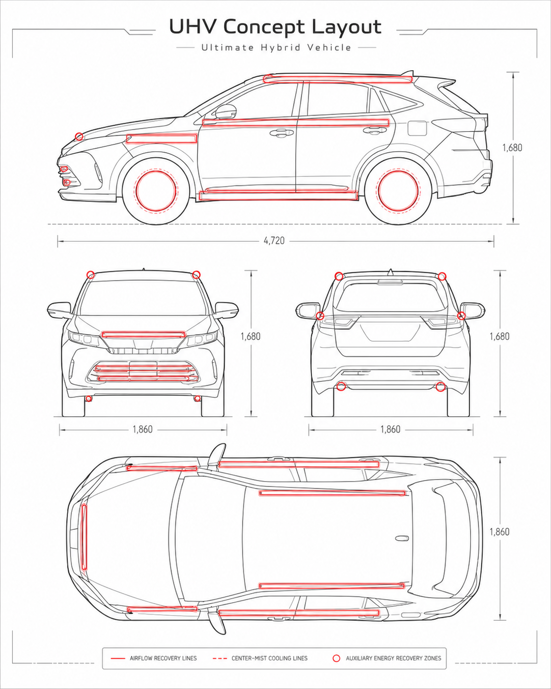

# 究極のハイブリッド車 UHV 構想案

[English](README.md) | [العربية](README_ar.md)

走行風エネルギー回収とセンターミスト気化冷却を統合する、気候適応型車両のためのオープン発明構想です。特に乾燥気候、砂漠都市、既存都市交通への後付け冷却システムを対象とします。

センターミスト冷却では、地域条件に応じて、雨水・ドレン水などの外部回収水を利用する方式と、水道水やボトル水を直接タンクへ補給する方式を使い分ける。

センターミスト冷却では、水タンク衛生、循環、ろ過、メンテナンスが重要である。戻り水やオーバーフロー水の自然な高低差を利用する重力落下式マイクロ水力回収ラインは、失われる小さなエネルギーを補助的に回収する候補であり、主電源ではない。

乾燥・粉塵地域、降雨・二系統供給地域、拠点管理フリート向けの代表的メンテナンス周期表を追加している。

## Ultimate Hybrid Vehicle Concept

### AER-Loop × Center-Mist Cooling による環境調律型モビリティ

---

## 概要

**究極のハイブリッド車 UHV（Ultimate Hybrid Vehicle）** は、従来のハイブリッド車、EV、PHEV、自動運転車とは異なり、車両を単なる移動手段ではなく、**走行風・回生エネルギー・排熱・水循環・気化熱冷却を統合する移動式環境補完ノード**として再定義する構想である。

従来の自動車開発は、主に以下の課題に集中してきた。

* 燃費改善
* 排出ガス削減
* バッテリー容量の拡大
* 航続距離の延長
* 自動運転性能の向上
* 充電インフラの整備

これらは重要な技術的進歩である。
しかし、都市環境の視点から見ると、自動車は依然として多くの熱、乱流、制動エネルギー、補機損失、空調排熱を周囲に捨てている。

UHV構想は、この「捨てられていた物理現象」を再設計し、車両そのものを以下のような存在へ変換することを目的とする。

> 車が走ることで生じる風・熱・回転・制動・水の気化熱を統合し、移動しながら都市や道路周辺の熱環境を補完するモビリティ。

---

## 技術定義

### 1. Ultimate Hybrid Vehicle（UHV：究極のハイブリッド車）

**Ultimate Hybrid Vehicle（UHV）** とは、車両を単なる移動手段としてではなく、**環境適応型の移動インフラ**として再定義する構想である。

従来のハイブリッド車（HEV/PHEV）が主に燃費改善、排出削減、バッテリー容量、航続距離の向上を目的としてきたのに対し、UHVは車両を**移動する環境補完ノード**として扱う。

UHVは、走行風制御、補助エネルギー回収、センターミスト蒸発冷却、水使用量制御、後付け車両モジュールを統合する構想である。目的は既存の車両動力系を置き換えることではなく、車両がもともと発生させる走行風、熱、制動エネルギー、回転、表面流をより知的に活用し、検証可能な条件下で局所的な熱緩和を支援する可能性を探ることである。

UHVは、認証済み車両システムや実証済み商用製品ではなく、概念的・技術的な提案である。

### 2. AER-Loop（Airflow Energy Recovery Loop）

**AER-Loop** とは、**Airflow Energy Recovery Loop（走行風エネルギー回収ループ）** の略称である。

これは、車両周辺の走行風、乱流、回転、制動エネルギー、各種損失の一部を補助的に回収し、車載支援システムへ再利用することを検討する分散型補助回収構想である。

候補要素には、垂直軸マイクロ風力発電、走行風ダクト、回生ブレーキ、磁気式または誘導式の回転回収機構、補助バッテリー、制御電子機器などが含まれる。

AER-Loopは主動力を得るための仕組みではない。車両自身の運動によって発生した走行風をエネルギー回収に利用する場合、回収エネルギーは必ず空気抵抗、車両効率、安全性、システム複雑性と合わせて評価する必要がある。

現実的な役割は、センサー、制御装置、冷却ファン、外部ミストモジュール、通信機器、非常灯、停車時の自然風発電などへの補助電力供給である。

### 3. Center-Mist Cooling（センターミスト冷却）

**Center-Mist Cooling** とは、制御された気流の中心部に微細な超音波ミストを供給する、環境適応型の蒸発冷却構想である。

目的は、空気と微細水滴の混合を改善し、条件が許す範囲で蒸発を促進し、水の気化熱を局所冷却に利用することである。

乾燥気候では、Center-Mist Coolingは車両周辺、道路、バス停、物流エリア、空港、港湾、その他の熱ストレスが高い環境において、局所的な熱緩和を支援する可能性がある。一方、湿潤気候では、蒸発効率が低下する場合や、路面濡れ、視界不良、過剰な湿度上昇、歩行者への影響が懸念される場合、出力を抑制または停止する必要がある。

Center-Mist Coolingは単なる散水装置ではない。湿度センサー、温度センサー、路面温度監視、視界安全制御、水質管理、検証済みの運用ルールを必要とする。

---

## 部分最適から文明設計へ

従来のハイブリッド車やEVは、燃費向上、排出削減、バッテリー利用、エンジン効率、回生ブレーキ、走行性能において重要な進歩を遂げてきた。

これらの改善には大きな価値がある。

しかし、その多くは車両単体の最適化である。

UHVは、その設計範囲を拡張する。

車両は、エネルギーを消費するだけの存在ではない。

走行中には、風、回転、制動エネルギー、熱、圧力差、水の移動、道路や都市空間との反復的な相互作用を生み出している。

これらを単なる損失として扱えば、車は移動のためだけに最適化された機械にとどまる。

しかし、これらを設計資源として扱えば、車両はより広い環境補完システムの一部になり得る。

ここに、部分最適と全体設計の違いがある。

UHVは、単に燃費や走行性能を高めることだけを目的としない。

移動体を、都市熱緩和、エネルギー回収、水循環、気流利用、安全統治、環境調整へ接続することを目指す。

これは、単なる技術部品の違いではない。

思想の違いである。

思想がなければ、技術は孤立した部品の最適化にとどまりやすい。

思想があれば、技術は車両、都市、環境、安全、水、熱、気流、エネルギー循環をつなぐ文明設計へ向かう。

本節は、概念的な設計思想を示すものである。

UHVが商業的に実証済み、認証済み、または現実の都市温度を制御できることを証明済みであると主張するものではない。

実装には、工学的検証、安全試験、メンテナンス試験、水質評価、熱環境測定、地域法規への適合確認が必要である。

---

## コンセプト

UHVは、単一の新型エンジンや単一の冷却装置ではない。
複数の既存技術および派生技術を組み合わせた、**複合型・分散型・後付け可能な車両環境システム**である。

基本構成は次の3層である。

```text
Ultimate Hybrid Vehicle: UHV
│
├─ 1. AER-Loop層
│   ├─ 走行風の一部回収
│   ├─ 垂直軸マイクロ風力発電
│   ├─ 回生ブレーキ
│   ├─ シャフト・ギア周辺の微小発電
│   ├─ 停車時の自然風発電
│   └─ 補機電源・冷却系への再利用
│
├─ 2. Center-Mist Cooling層
│   ├─ 超音波ミスト冷却
│   ├─ 中心気流へのミスト注入
│   ├─ 中空軸構造
│   ├─ 偏心ドライブ構造
│   ├─ 螺旋帰還構造による大粒水滴の回収
│   └─ 乾燥地域での気化熱冷却
│
└─ 3. Retrofit Mobility層
    ├─ 既存車両への後付け
    ├─ バス・トラック・タクシーへの搭載
    ├─ 鉄道・船舶・作業車両への応用
    ├─ 乾燥地帯・砂漠都市への導入
    └─ 都市冷却インフラとしての展開
```

---

## 背景

都市の高温化は、単に気温上昇だけの問題ではない。
アスファルト、コンクリート、建物密集、交通量、空調排熱、工場排熱、データセンター排熱などが複合し、局所的な熱環境を悪化させている。

特に道路は、以下の理由により都市熱の主要な蓄熱面となる。

* 太陽光を受けて高温化しやすい
* アスファルトが熱を蓄える
* 車両排熱が集中する
* タイヤ摩擦・ブレーキ熱が発生する
* 夜間も蓄熱した熱を放出する
* 歩行者・自転車・公共交通利用者が直接影響を受ける

従来のEVやハイブリッド車は、排出ガスの削減には貢献するが、道路周辺の熱環境を直接改善する機能はほとんど持たない。

UHV構想は、ここに新しい視点を導入する。

> 車両を単なる熱源として扱うのではなく、走行中の風・回転・水・冷却機構を利用し、都市熱を局所的に緩和する移動式インフラとして扱う。

---

<p align="center">
  
</p>

**図1：UHVの実写風コンセプトイメージ。**  
走行風回収とセンターミスト冷却の思想を統合した、環境調律型クロスオーバー車両の完成イメージ。

<p align="center">
  
</p>

**図2：UHV構想図（CAD風レイアウト）。**  
走行風回収ライン、センターミスト冷却ライン、補助エネルギー回収ゾーンの候補配置を示す概念図。

---

## 基本思想

UHVの基本思想は、以下の5点に整理できる。

### 1. 失われるエネルギーを補助的に回収する

車両走行中には、多くのエネルギーが以下の形で失われる。

* 空気抵抗
* 乱流
* 制動熱
* 回転損失
* タイヤ周辺の気流
* モーター・バッテリー・インバーターの排熱
* 空調負荷

UHVでは、これらを完全に回収するのではなく、**補機電源・センサー・冷却ファン・制御装置・非常用電源**などに使える範囲で分散的に回収する。

重要なのは、走行風発電を主動力として扱わないことである。
車両が自ら作り出した走行風から無限のエネルギーを得ることはできない。

そのためUHVにおける走行風回収は、永久機関ではなく、以下のような補助回収である。

> 本来、抵抗・乱流・熱として失われる一部を、補助電力や冷却制御に再利用するための分散回収技術。

---

### 2. 車体表面を空力回収ラインとして利用する

車体のルーフ、サイド、フロント、リア、バンパー、タイヤ周辺には、走行中に複雑な気流が発生する。

UHVでは、車体表面の一部を以下の機能に転用する。

* 垂直軸マイクロ風力発電
* 走行風取り込みダクト
* ミスト冷却用送風経路
* 排熱拡散ライン
* 車体表面冷却ライン
* 補機電源回収ライン

特に垂直軸風力発電は、風向の変化に比較的強く、横風や乱流を受けやすい車体周辺への組み込みに向いている。

ただし、空気抵抗を増やしすぎると車両効率が悪化するため、設計上は以下が重要となる。

* 前方投影面積を増やしすぎない
* 乱流を悪化させない
* 整流効果と発電効果を両立する
* 発電量よりも冷却補助・センサー電源として評価する
* 車両安全基準に適合させる

---

### 3. ミスト冷却を車両外部に統合する

UHVの重要な特徴は、**センターミスト冷却ファン**を車両外部に搭載する点である。

一般的なミスト冷却は、ノズルから水を細かく噴霧する方式が多い。
しかし、この方式には以下の課題がある。

* 大粒の水滴が残る
* 路面や歩行者が濡れる
* 風とミストが均一に混ざらない
* 高湿度環境では蒸発効率が低い
* 水滴による視界不良の可能性がある
* 車両搭載には防水性・耐振動性の課題がある

センターミスト冷却ファンは、これらを改善するために、ファンの中心部へ超音波ミストを供給し、走行風や送風流と混合させる。

中心部からミストを入れることで、ミストが空気流と混ざりやすくなり、気化熱冷却の効率を高めることを目指す。

---

### 4. 乾燥地域では気化熱冷却を最大化する

UHVは特に、中東、砂漠都市、乾燥地域との相性が高い。

乾燥地域では空気中にまだ水蒸気を受け入れる余地が大きいため、水が蒸発しやすい。
水が蒸発するときには、周囲から熱を奪う。これが気化熱である。

したがって、乾燥地域ではミスト冷却の効果が比較的高くなる。

想定される導入地域は以下である。

* 中東の都市
* 砂漠道路
* 空港周辺
* 港湾施設
* 物流拠点
* 大規模駐車場
* 観光地の移動交通
* 工事現場
* 乾燥農地周辺
* 熱中症リスクの高い都市部

---

### 5. 乾燥地域以外ではエアコンとのハイブリッド冷却を行う

湿度の高い地域では、ミスト冷却の効率は低下する。
日本の夏のように高温多湿な環境では、水が蒸発しにくく、路面や周囲を濡らすリスクも高まる。

そのため、乾燥地域以外では、次のようなハイブリッド制御が適している。

```text
高温・低湿度：
    ミスト冷却を強める

高温・中湿度：
    ミスト冷却と送風を併用する

高温・高湿度：
    ミストを弱め、エアコン・送風・排熱制御を中心にする

雨天・視界不良時：
    外部ミストを停止する

都市部・歩行者密集地：
    噴霧量を制限し、路面濡れを防ぐ
```

つまりUHVは、ミスト冷却だけに依存する車両ではない。

> 気候条件に応じて、エアコン、送風、排熱制御、ミスト、回生電力を組み合わせる気候適応型モビリティである。

---

## 技術構成

### 1. AER-Loop

AER-Loopは、Airflow Energy Recovery Loop の略称として位置づけられる。
車両周辺の空気流、自然風、制動、回転系の損失を補助的に回収し、車載補機に利用する構想である。

主な構成要素は以下である。

* 垂直軸マイクロ風力発電
* 回生ブレーキ
* 車軸・シャフト周辺の微小発電
* ギア周辺の磁気・圧電・誘導発電
* 停車時の自然風発電
* 補助バッテリー
* 冷却ファン電源
* センサー電源
* 非常用電源

---

### 2. Center-Mist Cooling

Center-Mist Coolingは、ファン中心部にミストを供給し、気流の中心で微細水滴を拡散・蒸発させる冷却方式である。

主な構成要素は以下である。

* 超音波ミスト発生器
* 中空軸
* 中心ミスト噴射口
* 偏心ドライブ
* 螺旋帰還構造
* 大粒水滴回収経路
* 水タンク
* 湿度センサー
* 路面温度センサー
* 外気温センサー
* 車速連動制御

この方式の目的は、単に水を撒くことではない。
目的は、可能な限り水滴を細かくし、空気中で蒸発させ、気化熱によって周囲の熱を奪うことである。

---

### 3. Retrofit Cooling Unit

UHV構想の実装上の特徴は、車両全体を新造しなくても、一部機能を後付けできる点である。

外付けセンターミストクーラーを独立ユニット化すれば、以下のような車両に応用できる。

* 路線バス
* 観光バス
* 配送トラック
* タクシー
* 救急車
* 消防車
* 工事車両
* 農業機械
* 鉄道車両
* 船舶
* 空港作業車両
* 港湾作業車両

これにより、既存交通機関を段階的に都市冷却インフラへ変えることができる。

---

## 簡易物理モデル

以下は、UHVの冷却・回収効果を概算するための簡易モデルである。

### 1. 気化熱冷却

水が蒸発するときに奪う熱量は、概算で次の式で表せる。

```text
Q_evap = m_dot × L_v × η_evap
```

* `Q_evap`：気化熱による冷却量 [W]
* `m_dot`：水の蒸発量 [kg/s]
* `L_v`：水の蒸発潜熱 [J/kg]
* `η_evap`：実際に蒸発した割合、混合効率、環境補正を含む効率係数

水の蒸発潜熱は温度によって変化するが、概算では約 2.4 × 10^6 J/kg 程度として扱える。

この式から分かるように、ミスト冷却の本質は「水を撒く量」ではなく、**どれだけ細かくし、どれだけ空気中で蒸発させられるか**である。

---

### 2. 走行風の動圧

走行中の空気流が持つ動圧は、次の式で表せる。

```text
q = 1/2 × ρ × v^2
```

* `q`：動圧 [Pa]
* `ρ`：空気密度 [kg/m^3]
* `v`：車両に対する相対風速 [m/s]

車速が上がるほど、動圧は速度の二乗で増加する。
そのため、走行風はミスト拡散や冷却用送風には有利に働く。

ただし、走行風から発電する場合、過度にエネルギーを取り出すと空気抵抗が増加する。
したがって、主目的は主動力の獲得ではなく、補助電力・冷却制御・センサー駆動とするべきである。

---

### 3. 風力回収の概算

風から取り出せる理論的な出力は、概算で次の式で表せる。

```text
P_wind = 1/2 × ρ × A × v^3 × C_p × η
```

* `P_wind`：風力から得られる出力 [W]
* `ρ`：空気密度 [kg/m^3]
* `A`：受風面積 [m^2]
* `v`：相対風速 [m/s]
* `C_p`：風車の出力係数
* `η`：発電機・整流・電力変換効率

この式は、車体搭載風力の概算にも使える。
ただし、走行風を利用する場合は、得られる電力だけでなく、増加する空気抵抗も同時に評価する必要がある。

そのため、UHVでは風力発電を以下の用途に限定するのが現実的である。

* センサー電源
* 外部ミスト制御
* 補助ファン
* 通信モジュール
* 非常用ライト
* 補助バッテリー充電
* 停車中の自然風発電

---

## 制御アルゴリズムの考え方

UHVでは、ミスト冷却を常時最大出力で動かすのではなく、環境条件に応じて制御する必要がある。

主な入力値は以下である。

* 外気温
* 相対湿度
* 路面温度
* 車速
* 風速
* 風向
* 歩行者密度
* 雨天判定
* 視界状況
* 水タンク残量
* バッテリー残量
* 車内空調負荷

簡易的な制御方針は以下である。

```text
if rain == true:
    mist_output = 0

elif visibility_risk == high:
    mist_output = 0

elif humidity > 80%:
    mist_output = very_low

elif humidity > 65%:
    mist_output = low

elif humidity > 45%:
    mist_output = medium

else:
    mist_output = high
```

さらに、路面温度が高く、湿度が低く、車速が一定以上である場合には、ミスト冷却を強める。

```text
if road_temperature > threshold
and humidity < dry_threshold
and vehicle_speed > minimum_speed:
    activate_center_mist_cooling()
```

このように、UHVの冷却機構は、気候条件と安全条件に応じた可変制御が必要である。

---

## 想定される応用分野

### 1. 中東・砂漠都市

中東や砂漠都市では、低湿度・高温・強日射という条件がそろっているため、気化熱冷却との相性が高い。

想定用途は以下である。

* 都市交通
* 空港シャトル
* 観光バス
* 物流車両
* 砂漠道路
* 大規模開発地区
* 屋外イベント交通
* 建設現場車両

---

### 2. 都市ヒートアイランド対策

都市部では、バスや配送車など、同じ道路を頻繁に走る車両に後付けユニットを搭載することで、局所的な冷却効果を期待できる。

特に有効な対象は以下である。

* バス停周辺
* 駅前ロータリー
* 商業施設周辺
* 学校周辺
* 高齢者施設周辺
* 大型駐車場
* 歩行者空間に隣接する道路

---

### 3. 災害・熱中症対策

UHVは、災害支援車両や熱中症対策車両にも応用できる。

* 避難所周辺の局所冷却
* 屋外待機列の冷却
* 救急搬送前後の外部冷却
* 消防・災害活動現場の熱対策
* 仮設住宅地周辺の温熱環境改善

---

### 4. 農業・緑化支援

乾燥地帯や農地周辺では、管理された条件下で水分保持支援や緑化支援にも応用できる。

ただし、微生物ミストなどを扱う場合は、安全性・生態系影響・地域規制を十分に検証する必要がある。

初期段階では、道路空間ではなく、農地、緑化帯、砂漠緑化実験区など、管理された場所で検証するのが望ましい。

---

## 技術的課題

UHV構想の実用化には、以下の課題がある。

### 空力面

* 車体抵抗の増加を抑える
* 風力回収ユニットの配置最適化
* 乱流の悪化を防ぐ
* 車両安定性への影響を検証する

### 冷却面

* 高湿度地域での効率低下
* 路面濡れの防止
* 歩行者へのミスト接触制御
* 視界不良の防止
* 水使用量の最適化

### 構造面

* 防水性
* 耐振動性
* 耐砂塵性
* メンテナンス性
* 水タンク容量
* 凍結対策

### 衛生・安全面

* 水タンクの衛生管理
* カビ・細菌繁殖の防止
* 噴霧水の品質管理
* 道路交通法規との整合
* 地域ごとの規制対応

### 社会実装面

* 後付けユニットの標準化
* 公共交通への試験導入
* 都市データとの連携
* 効果測定方法の確立
* 費用対効果の検証

---

## 段階的実装案

UHVは、いきなり完全な新型車両として実装する必要はない。
段階的には、以下のような進め方が現実的である。

```text
Phase 1:
    卓上・小型ファンによるセンターミスト冷却実験

Phase 2:
    自転車・小型カート・作業車への簡易搭載

Phase 3:
    バス・配送車への外付け冷却ユニット実証

Phase 4:
    乾燥地域・中東都市での実証試験

Phase 5:
    車体一体型AER-Loop搭載車両の設計

Phase 6:
    都市交通ネットワークとの統合
```

---

## 評価指標

UHVの有効性を検証するためには、以下の指標を測定する必要がある。

* 外気温変化
* 路面温度変化
* 車体周辺温度
* ミスト蒸発率
* 水使用量
* 発電量
* 補機電力削減量
* 車両空気抵抗の変化
* 走行効率への影響
* 歩行者快適性
* 視界への影響
* 路面濡れの有無
* メンテナンスコスト
* 都市スケールでの導入効果

---

## 本構想の位置づけ

UHVは、完成済み製品ではなく、オープン発明として公開する技術構想である。

目的は、特定企業による独占ではなく、研究者、エンジニア、自治体、交通事業者、学生、個人開発者が、自由に検討・改良・実験できる設計思想を共有することにある。

UHVは以下の思想に基づく。

* 技術は自然法則に従うべきである
* 車両は移動手段であると同時に都市環境の一部である
* 失われるエネルギーは、可能な範囲で再利用すべきである
* 熱をただ捨てるのではなく、循環・分散・冷却として再設計すべきである
* 既存インフラを破壊せず、後付け可能な形で改善すべきである

---

## 関連記事・関連リポジトリ

### 今回の記事

* 究極のハイブリッド車 UHV 構想案  
  https://note.com/inchacomusho/n/nd6cce23c57bc

### 過去の関連note記事

* AER-Loop 関連構想  
  https://note.com/inchacomusho/n/n2d8f31caf428

* 関連構想記事  
  https://note.com/inchacomusho/n/ndfc6d80d992a

* 関連構想記事  
  https://note.com/inchacomusho/n/nc9752b7c576f

### 関連GitHubリポジトリ  

* Center-Mist Ultrasonic Cooling Fan Concept  
  https://github.com/InchaComisho/Center-Mist-Ultrasonic-Cooling-Fan-Concept

## 関連するクーリングクレジット制度

* [Cooling Credit Framework / クーリングクレジット制度設計案](https://github.com/InchaComisho/Cooling-Credit-Framework)
  地球直接冷却、水循環再生、都市冷却、土壌保水、植生蒸散、海洋循環、排熱削減などの冷却効果を評価し、経済的インセンティブへ接続する制度設計案。

* [Arabic README / العربية](https://github.com/InchaComisho/Cooling-Credit-Framework/blob/main/README_ar.md)
  クーリングクレジット制度設計案のアラビア語版。乾燥地帯・高温地域・水循環型冷却との相性が高い内容。

* [NOTE：クーリングクレジットという温暖化対策](https://note.com/inchacomusho/n/n0f541b313ad2)
  カーボンクレジット中心の温暖化対策から、実際に熱を下げるクーリングクレジットへの転換を説明した日本語記事。

---

- [Sustainable Future Cooling Credit Portal](https://github.com/InchaComisho/Sustainable-Future-Cooling-Credit-Portal)
  サステナブル、サステナビリティ、SDGs、環境モビリティ、ESG、気候適応、都市冷却、文明OSなどの検索語から、クーリングクレジットへ接続する多言語検索入口ポータル。

## Repository Name

```text
Ultimate-Hybrid-Vehicle-UHV
```

---

## Suggested Repository Description

```text
Ultimate Hybrid Vehicle concept integrating AER-Loop airflow energy recovery and center-mist evaporative cooling for climate-adaptive mobility.
```

---

## Keywords

```text
Ultimate Hybrid Vehicle
UHV
AER-Loop
Airflow Energy Recovery
Center-Mist Cooling
Ultrasonic Mist Cooling
Evaporative Cooling
Dry Climate Mobility
Urban Cooling
Heat Island Mitigation
Retrofit Cooling Unit
Vertical Axis Wind Turbine
Regenerative Energy
Climate-Adaptive Vehicle
Direct Planetary Cooling
Natural Complementary Science
Artificial Wisdom
Open Invention
```

---

## License

This concept is published as an open invention.

The idea, structure, text, diagrams, models, and derivative concepts may be quoted, translated, modified, studied, simulated, prototyped, implemented, and commercially applied, provided that attribution is given where possible.

Recommended attribution:

```text
Concept proposed by:
Master / inchacomusho / InchaComisho

Concept name:
Ultimate Hybrid Vehicle: UHV

Related concepts:
AER-Loop
Center-Mist Ultrasonic Cooling Fan Concept
Natural Complementary Science
Artificial Wisdom
```

A formal open-source license file may be added later, such as:

* CC BY 4.0 for documents, diagrams, simulation code, and hardware design files

---

## 著者

マスター / inchacomusho / InchaComisho

日本の独立構想者、観測者、提案者、AI調律者、人工叡智の定義者。  
自然補完科学の学問体系の構築・提唱者。  
クーリングクレジット・フレームワークの定義者、自然冷却価値評価プロトコルの創設者・原著作者。  
温暖化因果構造と完全解決策の定義者・体系化者。

マスターは、地球温暖化を単なるCO₂濃度の問題ではなく、森林喪失、土壌劣化、水循環断絶、水の相転移の弱体化、大気循環・海洋循環・食の循環／有機物循環の弱体化、蒸散・雲形成・降雨循環の弱体化、自然冷却フィードバックの停止として統合的に捉え、その解決策を排出削減、炭素固定源回復、物理的冷却、自然冷却機能の再起動、MRV、クーリングクレジット、文明OSへ接続する公開フレームワークとして提示している。

自然法則思想、地球循環再生、AIとの共創を中心に、NOTE・GitHub・各種公開媒体を通じて公開活動を行う。

## Collaborating AI

G（OpenAI ChatGPT）
ミニ（Google Gemini）
クルス（Anthropic Claude）
リアル（Perplexity AI）
マナ（Manus）
ローラ（Dola）
Google検索AI

---

## Publication

Initial concept integration: June 2026

---

## Disclaimer

This repository presents a conceptual and technical proposal.
It is not a certified automotive design, safety-approved vehicle system, or validated commercial product.

Any implementation must be tested under appropriate engineering, legal, safety, environmental, and regulatory conditions.

Particular care is required for:

* road safety
* visibility
* water usage
* humidity-dependent performance
* electrical waterproofing
* maintenance
* microbial safety
* vehicle aerodynamic performance
* local transportation regulations

---

## Summary

The Ultimate Hybrid Vehicle UHV concept proposes a new direction for mobility.

Instead of treating vehicles only as sources of movement, emissions, heat, and energy consumption, UHV treats them as mobile environmental nodes that can recover part of their lost energy, support cooling systems, and reduce local heat stress through climate-adaptive external cooling.

The central idea is not to create a perpetual-motion vehicle.
The central idea is to use what vehicles already produce — airflow, heat, braking energy, rotation, and motion — more intelligently.

By combining AER-Loop, center-mist cooling, hybrid air-conditioning, and retrofit vehicle modules, UHV aims to transform transportation from a passive heat source into an active component of urban and planetary thermal regulation.

---

## 関連ポータル・エネルギー構想リポジトリ

### ポータル系リポジトリ

* [Artificial Wisdom Portal](https://github.com/InchaComisho/Artificial-Wisdom-Portal)
* [科学技術は思想によって方向づけられる](https://github.com/InchaComisho/Artificial-Wisdom-Portal/blob/main/docs/SCIENCE_TECHNOLOGY_AND_PHILOSOPHY_ja.md)
* [Master Knowledge Portal](https://github.com/InchaComisho/Master-Knowledge-Portal)
* [Global Warming Causal Structure Portal](https://github.com/InchaComisho/Global-Warming-Causal-Structure-Portal)

### エネルギー・インフラ系リポジトリ

* [REIMEI Nature-Inspired Energy Architecture](https://github.com/InchaComisho/REIMEI-Nature-Inspired-Energy-Architecture)
* [Dual-Core Edge Magnetic Structure for Universal Rotational Energy Harvesting](https://github.com/InchaComisho/Dual-Core-Edge-Magnetic-Structure-for-Universal-Rotational-Energy-Harvesting)
* [REIMEI Civilization Planetary Circulation Transition](https://github.com/InchaComisho/REIMEI-Civilization-Planetary-Circulation-Transition)
* [REIMEI-NOP Natural Origin Plasma Generator](https://github.com/InchaComisho/REIMEI-NOP-Natural-Origin-Plasma-Generator)
* [Distributed Renewable Infrastructure vs. Fusion Monocentrism](https://github.com/InchaComisho/Distributed-Renewable-Infrastructure-vs.-Fusion-Monocentrism)

---
## 関連する安全思想

UHV構想は、より広い自動車安全思想とも接続する。

- [事故を起こさない自動車設計フレームワーク](https://github.com/InchaComisho/Zero-Accident-Vehicle-Design-Framework/blob/main/README_ja.md)
- [Zero-Accident Vehicle Design Framework](https://github.com/InchaComisho/Zero-Accident-Vehicle-Design-Framework/blob/main/README.md)
- [إطار تصميم المركبة التي لا تُسبب الحوادث](https://github.com/InchaComisho/Zero-Accident-Vehicle-Design-Framework/blob/main/README_ar.md)
- [交通安全革命2：究極の自動車とは、事故を起こさない車である](https://note.com/inchacomusho/n/n43c01b8465f0)

UHVは、気候適応型モビリティを提案する。
事故を起こさない自動車設計フレームワークは、生命保護型モビリティを提案する。

両者を合わせることで、気候に適応しながら事故リスクを構造的に減らす次世代自動車モデルが見えてくる。


## Documentation

* [Technical Overview](docs/technical_overview.md)
* [AER-Loop Model](docs/aer_loop_model.md)
* [Center-Mist Cooling Model](docs/center_mist_cooling_model.md)
* [Retrofit Implementation Plan](docs/retrofit_implementation_plan.md)
* [Middle East Deployment](docs/middle_east_deployment.md)
* [Safety and Regulatory Considerations](docs/safety_and_regulatory_considerations.md)
* [Evaluation Metrics](docs/evaluation_metrics.md)
* [代表ケースモデル](docs/representative_case_model.md)
* [人体熱ストレスとの接続](docs/human_heat_stress_interface.md)
* [水使用量と湿度シナリオ](docs/water_and_humidity_scenarios.md)
* [速度別エネルギープロファイル](docs/speed_energy_profile.md)
* [雨水回収式・駐車時ミスト遮熱モード](docs/rainwater_parking_mist_shield_ja.md)
* [保護型ペロブスカイト・ソーラースキン](docs/perovskite_protective_solar_skin_ja.md)
* [駐車時補助エネルギー維持モード](docs/parked_auxiliary_energy_maintenance_ja.md)
* [UHV適応制御・安全制御システム](docs/adaptive_control_and_safety_system_ja.md)
* [速度統治・生命保護制御レイヤー](docs/speed_governance_life_protection_control_ja.md)
* [センターミスト冷却の水供給方式](docs/center_mist_water_supply_modes_ja.md)
* [センターミスト水タンク衛生と重力落下式回収](docs/center_mist_tank_hygiene_and_recovery_ja.md)
* [移動型ミスト冷却効果モデル](docs/mobile_mist_cooling_effect_model_ja.md)
* [センターミスト冷却メンテナンス周期表](docs/center_mist_maintenance_schedule_ja.md)
* [移動型ミスト冷却サンプル結果](results/mobile_mist_cooling_sample_results.md)
* [Simulations](simulations/README.md)

---

## 関連するクーリングクレジット事業モデル

Cooling Credit Framework の事業モデル群のうち、このリポジトリと実装・制度設計上の接点が強い文書への逆リンクです。

UHVの外部冷却、車両冷却、交通機関向け後付け冷却と接続する事業モデルです。

- [センター超音波ミスト冷却ファン事業モデル](https://github.com/InchaComisho/Cooling-Credit-Framework/blob/main/docs/business_models/CENTER_MIST_ULTRASONIC_COOLING_FAN_BUSINESS_MODEL_ja.md)