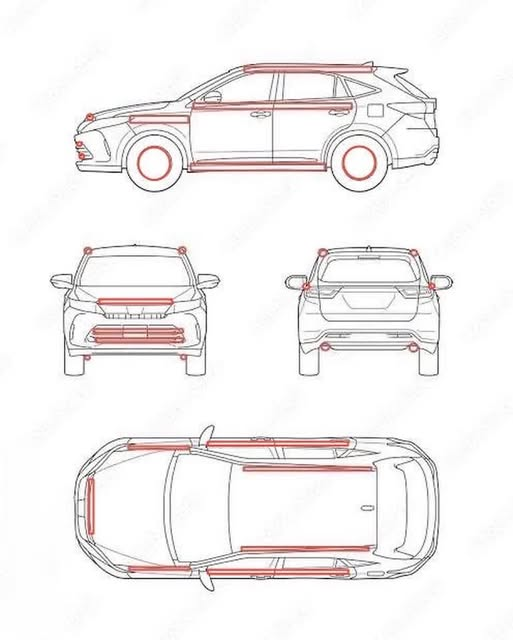

# UHVの部品配置と機能配置のガイド

[English Version](uhv_component_layout.md)

## 目的

この文書は、**究極のハイブリッド車UHV**の視覚的な配置図を、気流回収、センターミスト冷却、補助電力の回収、後付けの設置のための、機能配置のマップとして、どう解釈できるかを説明する。

この図は、確定した工学的な設計図ではない。UHVの主要なサブシステムがどこに配置されうるか、そして車両の各ゾーンがどのような機能を支えうるかを明らかにすることを意図した、**概念的な部品配置**である。

CAD風のコンセプト画像に示された寸法は、代表的な試作機のパッケージの寸法として扱うべきであり、確定した製造仕様ではない。規模と配置の議論には有用だが、認証された量産車両を定義するものではない。

<p align="center">
  
</p>

<p align="center">
  <em>図1：UHVの概念図。赤い線と円は、気流回収、冷却用の気流、センターミスト冷却、軸に関連する回収、後付けモジュールの候補ゾーンを示す。</em>
</p>

---

## 赤い配置マークの解釈

UHVの図の赤い線と円は、固定された部品の仕様ではなく、**統合の候補ゾーン**として解釈できる。

それらは、次の機能の一つ以上が統合されうる領域を示す。

* 気流の取り入れと流れの誘導
* 垂直軸のマイクロ風力発電
* 補助電力の回収
* センターミスト冷却の気流
* 路面に隣接した気化冷却
* 車体表面の熱拡散
* 車輪周りの熱と乱流の管理
* 外付けの冷却ユニットのための、後付けの取り付け点

目的は、車両の運動から無限のエネルギーを取り出すことではない。気流に基づく回収は、いずれも、それが生む追加の空気抵抗とあわせて評価しなければならない。

UHV構想では、気流の回収は、センサー、冷却ファン、制御ユニット、通信モジュール、非常灯、補助システムのための**補助的な回収**として扱われる。

---

## 機能ゾーン

| 車両のゾーン | 候補となる機能 | 備考 |
|---|---|---|
| ルーフライン | 気流の回収、流れの誘導、補助発電 | 比較的連続した気流だが、抗力の増加は最小限にしなければならない |
| 側面の上部ライン | 境界層の気流の利用、冷却ダクトの経路 | 細いダクトや低背の回収モジュールを支えうる |
| フロントグリル／バンパー | 取り入れ、熱交換、ミストと空気の混合の入口 | 動圧が強いが、安全と抗力を制御しなければならない |
| サイドスカート | 床下の流れの誘導、冷却気流の経路 | 路面に隣接した熱とタイヤ周りの乱流の管理に役立ちうる |
| 車輪周り | 乱流の候補ゾーン、軸に関連する回収、局所的な冷却 | 振動、粉塵、水、安全上のリスクが大きく、慎重な検証が必要 |
| 後部 | 後流の管理、排気気流の拡散、任意のミスト分散 | 視認性の問題と路面の濡れを避けなければならない |
| 床下 | 気流の通路、熱拡散の経路 | 水、砂、破片、衝撃からの保護が必要 |

---

## 1. ルーフラインと側面上部の気流ゾーン

ルーフラインと側面の上部ラインは、低背の気流回収または誘導モジュールの候補となる場所である。

考えられる機能には、次のものが含まれる。

* 小型の垂直軸の気流回収ユニット
* 統合された気流ダクト
* 表面の冷却チャネル
* 補助ファンの吸気経路
* 風速、湿度、温度のセンサー

これらのゾーンでは、車輪周りに比べて、比較的安定した気流を受けうる。しかし、追加するどの部品も、前面投影面積、空気抵抗、風切り音、車両の不安定さを大きく増やさないよう設計しなければならない。

推奨する設計の方針：

* 低背の形状を用いる
* 電力の回収よりも、まず流れの整流を優先する
* 発電した電力は補助的なものとしてのみ扱う
* CFDまたは風洞試験で、空気抵抗を評価する
* 安全上のリスクを生みうる突出した構造を避ける

---

## 2. 前部の取り入れと冷却の相互作用ゾーン

フロントグリルとバンパーの領域は、車両の走行中に、入ってくる気流を直接受ける。

UHV構想では、このゾーンは次を支えうる。

* センターミストの混合のための気流の取り入れ
* 車載システムの熱交換
* 外部の気化冷却ユニットへの取り入れ
* ダクトへの、圧力を利用した気流の供給
* 温度と湿度の環境センシング

この領域は、高い動圧を自然に受けるため、機械的に魅力的である。しかし、安全上も重大な場所である。

設計上の考慮事項には、次のものが含まれる。

* 歩行者の安全
* 水と粉塵からの保護
* 耐衝撃性
* 視認性と噴霧の制御
* 路面の濡れの防止
* 既存の冷却システムとの適合性

前部の取り入れ口は、制御されていない空気取り入れ口ではなく、制御された気流の入口として扱うべきである。

---

## 3. サイドスカートと下部の車体ゾーン

下部の側面とサイドスカートの領域は、アスファルト、タイヤ、車両の流れからの熱が蓄積する路面の近くにある。

UHVの考えられる機能には、次のものが含まれる。

* 路面に隣接した冷却気流
* 乾燥気候での、低い位置でのミスト分散
* 床下の気流の誘導
* 補助ダクトの配管
* 路面付近の熱センシング

このゾーンは、路面に近いため、局所的な熱の緩和にとって重要かもしれない。しかし、道路を濡らしたり、歩行者に影響したり、車両の安定性を乱したりしないよう、慎重に制御しなければならない。

推奨する検証項目：

* 路面温度の変化
* ミストの蒸発率
* 濡れた路面のリスク
* 歩行者の曝露
* タイヤの接地性への影響
* 床下の気流への影響

---

## 4. 車輪周りの候補ゾーン

車輪周りの赤い円は、乱流の管理、局所的な冷却、軸に関連する補助的な回収の候補ゾーンとして解釈できる。

考えられる機能には、次のものが含まれる。

* タイヤ周りの熱のセンシング
* 乾燥気候での、局所的なミストによる冷却の補助
* 軸またはハブに隣接したマイクロ発電
* 乱流に導かれたミストの分散
* ブレーキの熱の監視
* ホイールハウス周りの気流の方向転換

しかし、車輪周りは、実用的な実装が最も難しいゾーンの一つである。

主なリスクには、次のものが含まれる。

* 振動
* 砂と粉塵
* 泥と水
* 機械的な衝撃
* 保守の負担
* ブレーキとタイヤの安全
* 路面を濡らすリスク
* 規制上の制約

したがって、車輪周りの機能は、すぐに量産できる機能ではなく、**実験的な候補の機能**として検討すべきである。

現実的な最初のステップは、能動的な冷却や発電のモジュールを追加する前に、受動的なセンシングと気流の観察を行うことである。

---

## 5. 後部と後流の管理ゾーン

車両の後部には、後流、圧力回復の効果、車体から出る乱流の空気がある。

UHVの考えられる機能には、次のものが含まれる。

* 排気気流の拡散
* 乾燥した条件での、低出力のミスト分散
* 後方の環境センシング
* 後流の管理
* 自然風の中での駐車中の、補助的な気流回収

後部のミスト出力は、後続の車両、カメラ、センサー、歩行者、視認性に影響しうるため、慎重に制御しなければならない。

推奨する制限：

* 視認性のリスクが高いときは、能動的なミストを出さない
* 雨や霧の中では、ミストを出さない
* 交通が密集しているときは、出力を下げる
* 後続車両のフロントガラスに届く噴霧パターンを避ける
* 公道で、目に見えるプルーム（噴煙状のミスト）の形成を避ける

---

## 6. センターミスト冷却の統合

センターミスト冷却のサブシステムは、UHVの中核となる部品の一つである。

その概念的な特徴は、次のとおりである。

* 超音波によるミストの生成
* 気流への中心噴射
* 中空軸の構造
* 水の経路を駆動部品から分離する、オフセット駆動
* 大きな液滴を回収する、らせん状の戻り構造
* 湿度に基づく出力の制御
* 路面温度に基づく作動

目的は、道路に水を吹きかけることではない。

目的は、気流の中で蒸発し、潜熱の吸収を通じて熱を奪う、微細な液滴をつくることである。

このため、このシステムは、乾燥気候、砂漠の都市、管理された後付けの実証に、特に適している。

---

## 7. 後付けの設置クラス

UHVの配置は、異なる複雑さの水準で実装できる。

### クラスA：センサーのみの後付け

能動的な冷却を伴わない、基本的な環境モニタリング。

考えられる部品：

* 湿度センサー
* 周囲の気温センサー
* 路面温度センサー
* 気流センサー
* GPSと連動した熱の記録

これは、最も安全な最初の実装段階である。

### クラスB：受動的な気流ダクトの後付け

動力によるミスト出力を伴わずに、気流の誘導を追加する。

考えられる部品：

* 低背のダクト
* 気流の方向転換フィン
* 表面の冷却チャネル
* 保護された床下の気流の経路

### クラスC：制御されたセンターミスト冷却の後付け

厳格な環境制御のもとで、能動的なミスト冷却を追加する。

必要な制御の入力：

* 湿度
* 温度
* 車速
* 視認性
* 雨の検知
* 歩行者の密度
* 水タンクの状態

### クラスD：統合されたAER-Loopの試作機

補助的な気流回収と電力管理を追加する。

考えられる部品：

* 垂直軸のマイクロ風力発電
* 補助バッテリー
* ファンの電力回収
* 非常用の電力出力
* 駐車中の自然風による発電

このクラスには、詳細な空力の検証が必要である。

---

## 8. 安全と検証に関する注記

実際の実装は、工学、法務、安全の条件のもとで検証されなければならない。

重要な検証領域には、次のものが含まれる。

* 空気抵抗の増加
* 車両の安定性
* 路面の濡れ
* 視認性への影響
* 水の消費
* 電気的な防水
* 保守の負担
* 歩行者の曝露
* 砂と粉塵への耐性
* 微生物と水タンクの安全性
* 地域の交通規制

UHV構想は、無限のエネルギー、永久機関、保証された都市規模での冷却といった主張を避けるべきである。

望ましい表現：

* 局所的な冷却を支えるかもしれない
* 局所的な熱ストレスを減らしうる
* 現地での検証が必要
* 候補となる配置ゾーン
* 概念的な配置
* 補助的な回収のみ

---

## 9. 推奨する試作の経路

この配置のための実際的な検証の経路は、次のとおりである。

```text
Phase 1:
    小型の車両または縮尺模型の周りの気流をマッピングする。

Phase 2:
    赤線の候補ゾーンにセンサーを設置する。

Phase 3:
    受動的なダクトと気流の誘導を試験する。

Phase 4:
    管理された乾燥環境で、センターミスト冷却を試験する。

Phase 5:
    路面に隣接した温度、湿度、視認性、濡れを測定する。

Phase 6:
    抗力への影響が理解された後にのみ、補助的な回収モジュールを追加する。
```

---

## 10. まとめ

UHVの部品配置図は、概念的な思想と、考えられる工学的な経路との間の、視覚的な橋渡しを提供する。

赤い線と円は、次の候補ゾーンとして解釈できる。

* 気流の回収
* 気流の誘導
* センターミスト冷却
* 路面に隣接した熱の緩和
* 補助電力の回収
* 後付けモジュールの設置

最も有力な近い将来の応用は、完全に統合された新型車両ではなく、バス、配送車両、空港の車両、港湾の車両、乾燥気候の都市モビリティ・システム向けの、**後付けの冷却・センシングのモジュール**である。

この配置は、シミュレーション、試作、安全性のレビュー、現地試験の出発点として扱うべきである。

---

## 著者紹介

Master / inchacomusho / InchaComisho

独立した日本人の構想設計者、観察者、提案者、AIチューナー、人工叡智の定義者。  
学術的枠組み「自然補完科学」の創始者・提唱者。  
クーリングクレジット・フレームワークの定義者であり、自然冷却価値評価プロトコルの創始者・原著者。  
地球温暖化の因果構造とその完全な解決策の定義者・体系化者。

Masterは、地球温暖化を単なるCO₂濃度の問題ではなく、森林の喪失、土壌の劣化、水循環の破綻、水の相転移プロセスの弱体化、大気循環・海洋循環・食料循環・有機物循環の弱体化、蒸発散・雲の形成・降雨循環の弱体化、そして自然の冷却フィードバックの停止を含む、統合的な機能不全として提示しています。  
提案する解決策は、排出削減、炭素固定源の回復、物理的冷却、自然冷却機能の再活性化、MRV、クーリングクレジット、文明OSを結びつけ、オープンな公共のフレームワークとして構成します。

Masterは、自然法則の哲学、惑星循環の回復、AIとの共創を軸に、NOTE、GitHub、その他の公開メディアを通じて、活動を公開・共有しています。


## ライセンス

CC BY 4.0

この記事は、クリエイティブ・コモンズ 表示 4.0 国際ライセンス（CC BY 4.0）の下で公開されています。  
適切なクレジット表示を行う限り、共有、再配布、翻訳、改変、再利用が認められます。

